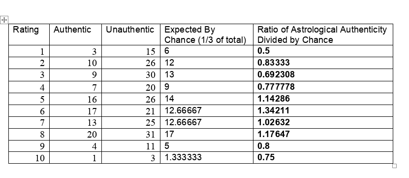
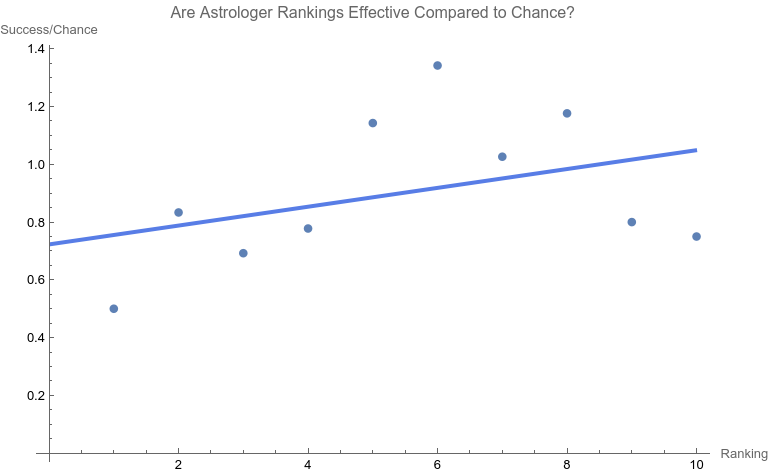
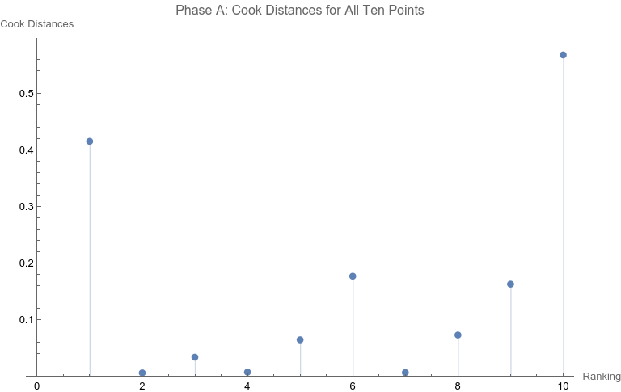
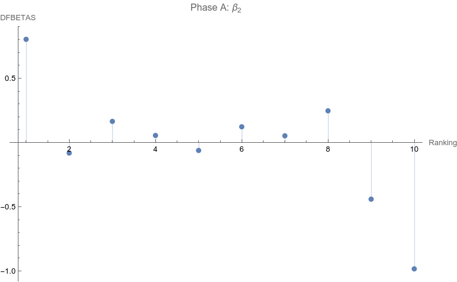
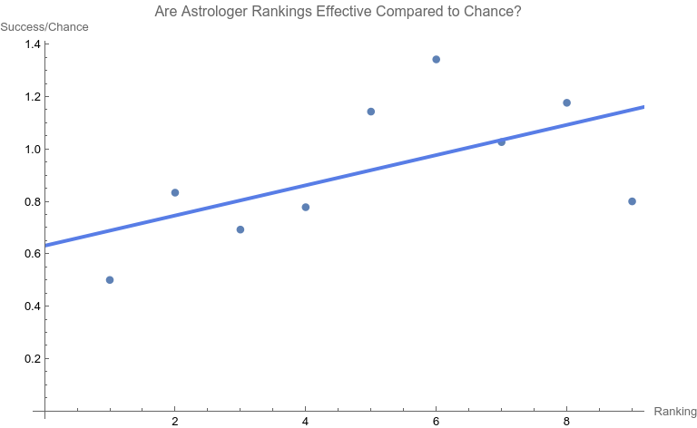
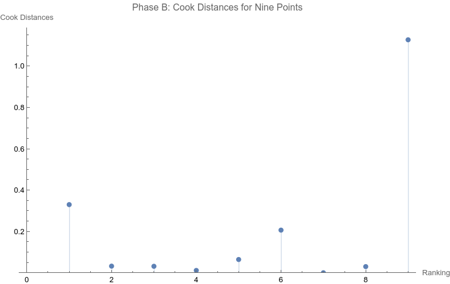
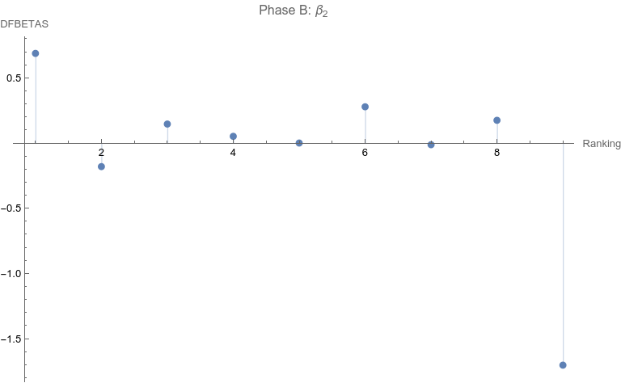
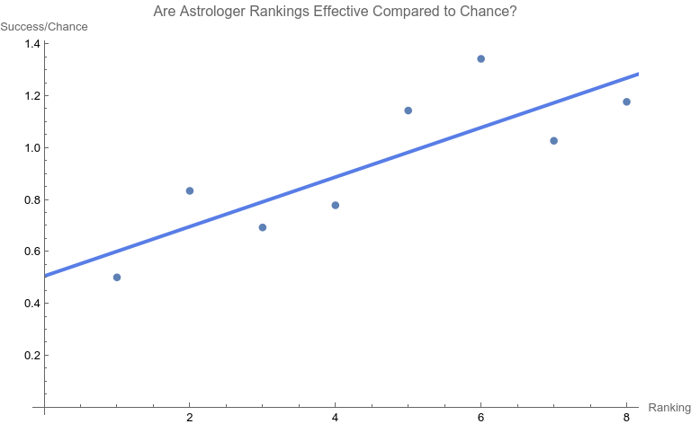
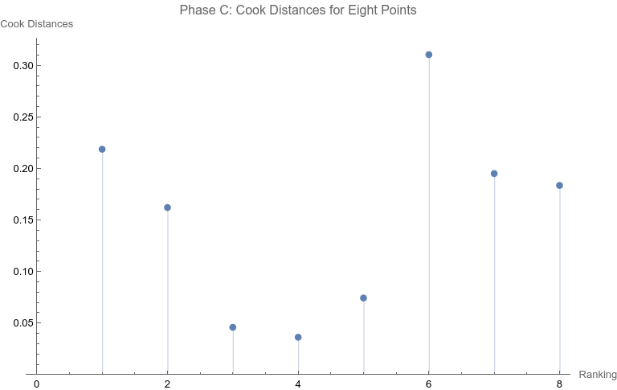
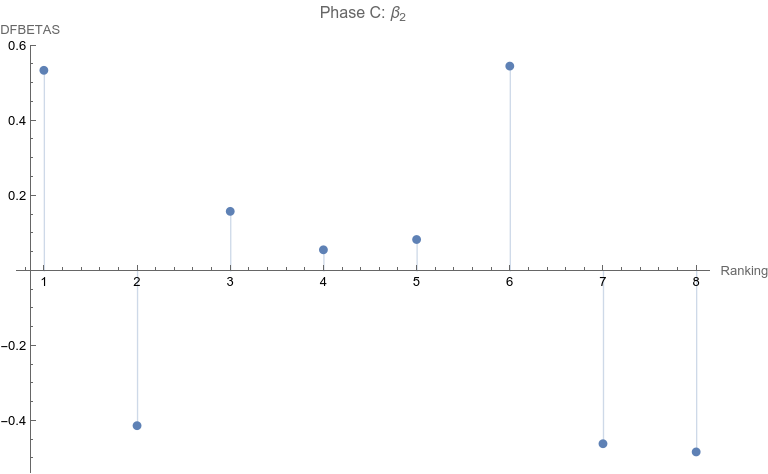

# Revisiting the 1985 Carlson Astrology Study: Debunking the Debunking with Modern Statistical Methods #

**Abstract**  
  
Shawn Carlson's 1985 study on astrology, published in _Nature_, has been highly influential in critiques of astrology as a scientifically valid phenomenon. However, the closure drawn on astrology in the study, based on the lack of statistical significance in the linear regression analysis of astrologers' performance, remains questionable. In this article, we revisit Carlson's study, focusing on Figure 2 and the linear regression. Applying modern, algorithmic influence-testing using Cook Distances and DFBETAS, we examine potential outliers and reformulate the best fit line, yielding relevant rankings of 1-8, comprising 93.8% of data. The resulting regression relation (y = 0.507 + 0.0954 x) has an ANOVA p-value for the slope term of 0.0113, indicating the astrologers' actions do have a statistically significant effect. R-squared for this model is 0.684. Our findings suggest that Carlson's conclusion might not adequately consider modern statistical techniques, even as they were available to him, and further quantitative analysis of astrology may still be relevant today.  
  
  
**Introduction  
​**  
In 1985, a recent Bachelor of Science graduate, Shawn Carlson, published in the premier science magazine (then or now) -- _Nature --_ a study of astrology!  
  
​It “was prepared as an account of work sponsored by the United States Government” and was declared “… a perfectly convincing and lasting demonstration” by the journal’s editor. \[1\]

**double-blind\_test\_of\_astrology\_-\_shawn\_carlson.pdf** << downloadable above

[Download File](double-blind_test_of_astrology_-_shawn_carlson.pdf "Download file: double-blind_test_of_astrology_-_shawn_carlson.pdf")

* * *

To say that the paper was and is influential would be a disservice. It is the single most effective critique of astrology in recent times. \[1\]  
  
Arguably the paper served the interests of debunkers and assuaged renascent throes of concern about astrology in the Euro-American general and scientific culture. Some forty years later, Carlson’s test of astrology also still  influences the position of many astrologers who contend that astrology is beyond quantitative analysis and is better understood as an art than a science. \[1\].  
  
While Carlson was working on the astrology study, a new statistician, R. Dennis Cook was just beginning his publication career. Cook’s contributions have proven to be prescient, protean, and vast. \[2, 3\]  
  
Whether you are a skeptic, debunker, or even a fan of astrology, it is important to know that Carlson’s limited study now must be said to be highly constrained by Cook’s much more far-ranging and massive work, work used in scientific crucibles of the highest capacity and resting easy on the transformative bonfires of time.  
  
**A Problem**  
  
There are many problems in construction, presentation, and conclusion with the Carlson study. \[1\] Here we will be focusing on Figure 2, the regression line.  
​  
First, let’s consider the data. Consistent with the publication standards of the time, Carlson did not release the original data. However, from Figure 3 in his paper the original tabular data may be surmised. \[1\] They are the following.

​The chosen astrologers endeavored to match charts to their owners. In a sort of double-blind fashion, the astrologers were given one true chart and two false options. They were asked to rate each match from one (least certain) to ten (most certain).  
​  
When the last column of data is graphed with its best fit line, a dismal picture emerges.

  
​The best fit line is y = 0.724701 +0.03262x with an ANOVA p-value of fit for the slope of the line being 0.276045. In other words, one can not claim that the slope (a measure of effect) is different from that for a flat line which has a slope of zero.   
  
That is to say, no statistical significance is found in the astrologers' actions compared to chance.  
  
Carlson relies heavily on the lack of significance in this type of regression relation in his conclusions.  
  
Is this the end of the story? Astrology is dead?  
  
Not at all.  
  
As others have brought up, there are major, legitimate, and co-existing concerns with the methodology of the study as a whole, such as:

*   the entropic travels of the experimental design
*   Likert-type issues
*   manipulation of sample size that balloons the chance of a false negative (and a negative is what was found here)
*   the fact that the absence of proof is not proof of absence
*   and there are actually many more. \[1\] \[8\]

  
I will focus on the particular linear regression above.  
  
**The Solution**  
  
Returning to one of the preeminent statisticians of our era, Cook innovated in many ways, and a preeminent one is the use of “Cook Distances” to identify highly influential points. \[4\]  
  
_“.... Cook's distance and DFFITS are conceptually identical.... Previously when assessing a dataset before running a linear regression, the possibility of outliers would be assessed using histograms and scatterplots_ \[Ed: as did Carlson\]. _Both methods of assessing data points were subjective and there was little way of knowing how much leverage each potential outlier had on the results data. This led to a variety of quantitative measures, including DFFIT, DFBETA....”_ \[4\]  
  
Influential points are not bad in themselves, but they do need to be checked for being an _undue_ **outlier**. The rational and consistent way to do this in recent years is through Cook Distances and DFBETAS. \[5, 6, 7\]  
  
An iterative, one-case deletion algorithm is appropriate for our one-variable linear regression. \[9\] The approach as a whole is not too complicated in practice:

1.  Compute the linear regression relation (as shown above).
2.  Check each point (and there are only at most 10 here) for Cook Distances that are higher than the conventional cut-off of 0.5. \[7\]
3.  For each such point, compute the DFBETAS for effect on the slope of the linear regression which again is the measure of effect size that we are interested in.
4.  If the absolute value of DFBETAS is higher than the conventional cutoff of two divided by the square root of n, that point is determined to be an outlier and should be removed from consideration.\[6\]
5.  Return to step one until all points are below outlier cut-offs.

  
Note that none of the steps in these tests are based on p-values. Let’s apply the set of computations to the data above.  
  
_Phase A: All 10 points are considered_  
**​**  
1\. The regression relation is depicted and described above.  
2. 

  
​The ranking of 10 is the only point that has a Cook Distance greater than the cut-off of 0.5. It is a candidate for consideration for DFBETAS for the slope.   
​  
3. 

  
​​4. The cutoff for n = 10 here is 2 divided by the square root of 10 or 0.632456. The point identified from step 2 that corresponds to a ranking of 10 has an absolute value that far exceeds that cut-off. It is thus a strong candidate as an outlier influence and should be removed.  
   
_Phase B: Rankings only of 1 through 9 are considered_**  
​**  
1.  The best fit linear regression is depicted.

The regression relation is y = 0.632761 + 0.0576959 x with an ANOVA p-value for fit for the slope term of 0.0950004.   
​  
The fit looks better already, but we have to follow the steps of the algorithm.  
  
​2.   

Here there is a clear outlier point at ranking of 9 whose Cook Distance far exceeds 0.5. It is a candidate for DFBETAS computation.  
​  
3.  

  
​4. The cutoff for n = 9 here is 2 divided by the square root of 9 or 0.66667. The point identified from step 2 that corresponds to a ranking of 9 has an absolute value that far exceeds that cut-off. It is thus a strong candidate as an outlier influence and should be removed.  
  
_Phase C: Rankings only of 1 through 8 are considered  
_  
​1 . 

The regression relation is y = 0.507038 + 0.0954128 x with an ANOVA p-value for fit for the slope term of 0.0112811.  
  
The fit looks way better behaved than how we started, but we still have to follow the steps of the algorithm.  
  
2.

  
​3. None of the Cook Distances are above the conventional cut-off of 0.5. We may conclude the algorithm.  
​  
4\. For completion’s sake, the DFBETAS for rankings 1 through 8 are depicted below. None of the |DFBETAS| for the slope term are above the conventional cut-off of 2 divided by the square root of 8 or 0.70711.

  
**​Conclusion**  
  
We have thus found through rigorous, modern influence-testing that the best fit line is more truly:

  
y = 0.507038 + 0.0954128 x  
  
with an ANOVA p-value for fit for the slope term of 0.0112811.   
  
​The effect size may be said to be 0.0954128 per unit increase of rank. R-squared for the entirety of this final model is 0.684298 which is another measure of effect.  
  
As a bonus to applying the algorithm in this case, the cost of removing outlier influence is not dear. Only 6.17%, a small number of chart matches out of the total of 308, needs to be removed (n = 4  for the ranking of ten and n = 15 for the ranking of nine). Those two rankings also happen to be the smallest groups of the ten.  
  
Moreover, the final regression relation suggests that astrologers' sense of authenticity of the chart compared to chance is only greater than one when the ranking is at five or above. This is exactly what one would hope.  
  
The removal of the 9th and 10th rankings is not because they are inconvenient but because standard contemporary diagnostic algorithms for point sensitivity in a linear regression require us to remove them.  
  
After all, "failure to conduct post model fitting diagnostics for variance components can lead to erroneous conclusions about the fitted curve." \[9\]  
  
​We have to gather that yes, there is effect in the astrologers’ actions, and this positive assessment is not hampered by an undue chance of it being a false positive, since the p-value of 0.0112811 is less than the conventional one-sided alpha of 0.05.  
  
_Nature_ should retract the article.

**Sites Cited**  
​  
\[1\] [http://www.astrology-research.net/researchlibrary/U\_Turn\_in\_Carson\_Astrology\_Test.pdf](http://www.astrology-research.net/researchlibrary/U_Turn_in_Carson_Astrology_Test.pdf)  
  
\[2\] [http://users.stat.umn.edu/~rdcook/CookPage/Bio.pdf](http://users.stat.umn.edu/~rdcook/CookPage/Bio.pdf)  
  
\[3\] [http://users.stat.umn.edu/~rdcook/CookPage/cookcv.pdf](http://users.stat.umn.edu/~rdcook/CookPage/cookcv.pdf)  
  
\[4\] [https://en.wikipedia.org/wiki/DFFITS](https://en.wikipedia.org/wiki/DFFITS)  
  
\[5\] [https://www.bookdown.org/rwnahhas/RMPH/mlr-influence.html](https://www.bookdown.org/rwnahhas/RMPH/mlr-influence.html)  
  
\[6\] [https://data.library.virginia.edu/detecting-influential-points-in-regression-with-dfbetas/](https://data.library.virginia.edu/detecting-influential-points-in-regression-with-dfbetas/)  
  
​\[7\] [https://online.stat.psu.edu/stat462/node/173/](https://online.stat.psu.edu/stat462/node/173/)  
  
\[8\] [https://independent.academia.edu/KennethMcRitchie](https://independent.academia.edu/KennethMcRitchie)  
  
\[9\] [https://escholarship.org/content/qt54h3s321/qt54h3s321\_noSplash\_5481a8a81db5affca388b35aab6964d4.pdf](https://escholarship.org/content/qt54h3s321/qt54h3s321_noSplash_5481a8a81db5affca388b35aab6964d4.pdf)

**Calculations:**

[

**carlson\_calculations.pdf**  << downloadable above

* * *
